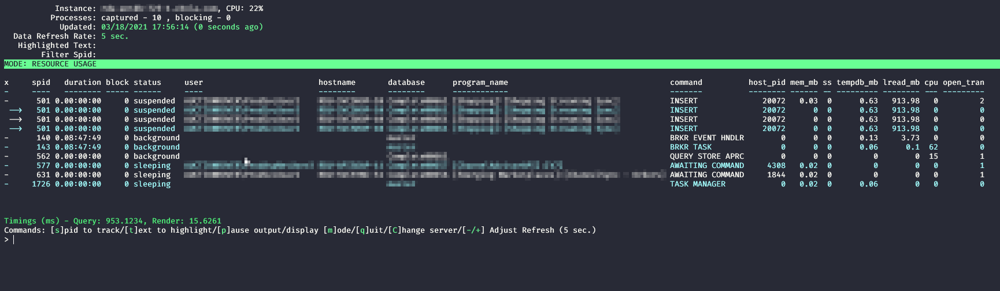
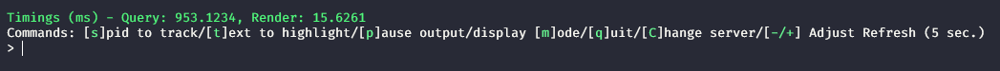
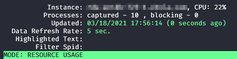
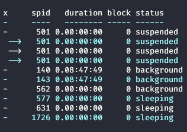

# SQLTop

## Introduction
`sqltop` is an interactive tool for viewing activity on a SQL Server instance. It displays an auto-refreshing view of all active processes on a SQL Server instance, much like `sp_who2` and `sp_WhoIsActive`. Beyond just displaying running sessions there are a host of other things you can do:

* Highlight sessions based on a given key word or phrase (maybe an application name, user name, or wait type)
* View a realtime blocking tree
* View the current cummulative performance data by program name
* Track a given session over time to see resource consumption and waits encountered
* View the current executing statement and execution plan for a given session
* Kill a running session
* And more!

This tool is heavily influenced by the power and ease of use of tools like `top` and `htop` from the Linux/Unix world.

## Usage
SQLTop is easy to use:
```
Invoke-SQLTop -SqlInstance <my_db_host> [-Credential <credential object>] [-SqlAuth]
```
* `SqlInstance` - the SQL Instance to connect to
* `Credential` - a credential object to use for SQL auth
* `SqlAuth` - when this parameter is used sqltop will try to pull credentials from a local file `sqltop.cred` in your user home directory.

### Creating a `.cred` File
If you need to use SQL auth on a regular basis, it might be a good idea to just store your credentials in a file and use the `-SqlAuth` parameter. To create your cred file:

```
$Credential = Get-Credential
$Credential | Export-CliXml -Path "${env:\userprofile}\sqltop.cred"
```

This will create a secure credential object that can be re-used in the future.

## Installation
SQLTop is not yet in the Powershell Gallery, but will be soon. For now, you can simply clone this repo into your PowerShell module path. To clone this to your default module path you can simply run this from a PowerShell prompt:

Using SSH:
```
git clone git@github.com:channeladvisor/sqltop.git "$($env:PSModulePath.Split(';')[0])/sqltop"
```

Using HTTPS:
```
git clone https://github.com/channeladvisor/sqltop.git "$($env:PSModulePath.Split(';')[0])/sqltop"
```

## Overview
There are a lot of different screens and options in SQLTop. Here I will go over the general approach taken to navigation and UI so you can explore the tool on your own.



### General Options
Navigation is broken up by display mode, but there are a few commands that will work in any screen:
* `p` - This will pause the refresh if you need to take a closer look at something you don't want to miss
* `q` - Will quit SQLTop
* `d` - Will open a debug view that will likely not mean much to you
* `C` - Upper-case C will change which server you are connected to

## Sorting
The sort order is currently hard-coded, but custom sort options will come in a future version. Most views are sorted by metrics related to the view (like the waits view being sorted by wait time), but the default view (Resource Usage) is a little different. In Resource Usage mode sessions are sorted by state then session id, pushing all "runnable" sessions to the top of the list, and anything sleeping or "background" is pushed to the bottom.

### Nav Bar
The main method of navigation is via the nav bar at the bottom othe screen:



This bar updates every time you change to a different display mode (option `m`) and will display the navigation choices for that mode. To navigate just press the key highlighted in square brackets. It's important to note that the navigation options **ARE** case sensitive.

### Filtering options
There are currently two options that can be used to filter or in some way highlight information on the screen:

* `[s]pid` - will filter the display down to a single session id
* `[t]ext to highlight` - will highlight sessions that contain the word or phrase you are looking for, and move them to the top of the process list

To remove either of these option, just press the key associated with the option and when prompted, just press enter and leave the input blank. So for example, if you had pressed `s` and filtered on session id 823, you could press `s` again and then just press enter to remove the filter.

### Instance Summary
At the top of the screen you will see the instance summary information.



This includes:

* The instance name and CPU % (CPU will only be displayed if you have remote WMI access to the instance in question)
* The number of processes seen, the number displayed if they don't all fit, and the number of processes currently experiencing blocking
* The last time the data was updated
* The current rate at which data is being refreshed

> Note: If the instance is under heavy load and is not able to return results within 5 seconds, SQLTop will slowly increase the refresh interval until the instance is able to supply data at that rate. Once the instance starts responding faster it will slowly work back down to a 5 second refresh interval. This is all to avoid putting extra load on the instance being monitored

* Highlight Test and Spid Filter will be blank unless either of those options are in use.

### Process List
The process list itself starts with a solid color bar telling you the current display mode you are in, by default this is `RESOURCE USAGE`, but will change as you make different navigation and filtering choices.

The process list itself has a number of column depending on the display mode. Here is a summary of the various columns you might see:
* `x` - This is a general purpose column, in most cases it is used to show if a process is running in parallel, or in the blocked process view it is used to draw the tree structure of the blocking chain.

    

* `spid` - The session id of the process
* `duration` - How long the session has been running
* `block` - The session id of the blocking session if one exists
* `host_pid` - The process id on the host system making the request, this can be useful for tracking a query back to a given remote host and process.
* `mem_mb` - Memory currently being used by the query in MB
* `ss` - If the session current has a snapshot transaction open. This is important to know if you are using RCSI.
* `tempdb_mb` - Amount of tempdb space being used by the session
* `lread_mb` - Amount of logical reads in MB
* `cpu` - Amount of cpu consumed by this process in milliseconds
* `open_tran` - Number of transactions being held open by the process
* `wt_ms` - Wait time in milliseconds
* `wt_type` - Wait type being encountered
* `wt_rsrc` - The resource the process is waiting on (TIP: Switch to wait mode and use the text filter option to filter for a given resource, this will show you all sessions waiting on that resrouce)

## Notes
* I **know** sysprocesses is deprecated, but it really is the best way to view worker-by-worker info for a parallel request. Also, if it's deprecated they should stop adding columns to it for new versions! (There is a new column for SQL Server 2019)
* There is an occassional bug where SQLTop will stop being able to retrieve data. I am not yet sure why this is happening. The data-retrieval process happens in a runspace that runs in the background, separate from the UI. This was done to make for a smoother user experience, but has also made connection issues harder to debug. If this happens just exit and open it back up until we can find the issue.
* This tool was written to have minimal impact on the instance, I know there is more information I could get, but currently this tool works even when the instance is ay 99% CPU, if I added much more it would be useless when troubleshooting high-CPU instances.
